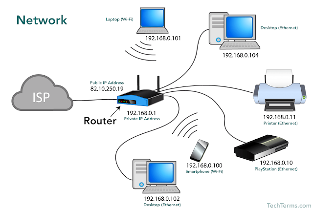
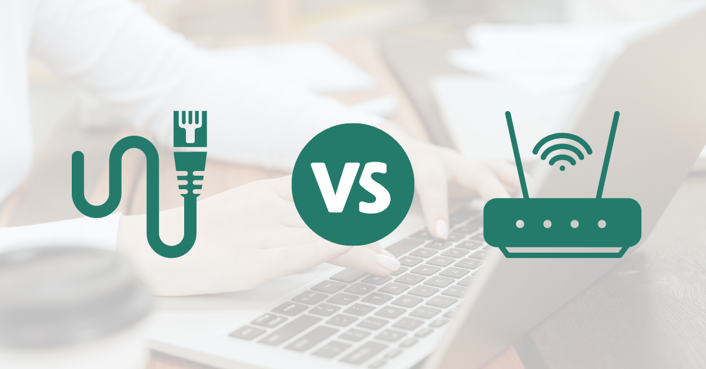
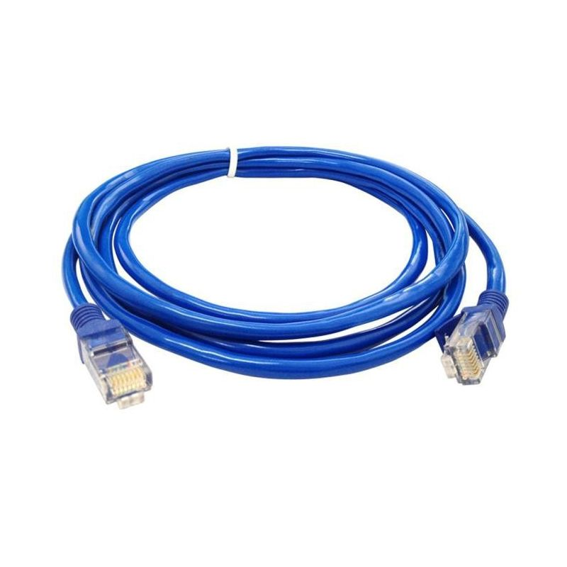
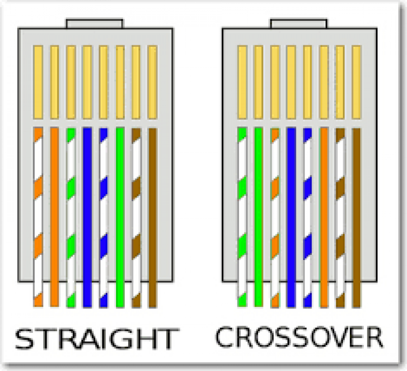

# PERTEMUAN 1 — Konsep Dasar Jaringan & Pengenalan Packet Tracer

**SI2514011 | Sub-CPMK-1 (C4) | Cisco Packet Tracer**

> Target akhir pertemuan: Anda memahami hakikat komunikasi data dari tingkat paling dasar, mengenal komponen pembentuk jaringan, serta mampu merangkai topologi Local Area Network (LAN) pertama Anda yang teruji berfungsi pada Cisco Packet Tracer.

---

## Tujuan

1. Mahasiswa memahami hakikat jaringan komputer, alasan dibutuhkannya, dan perbedaan media transmisi (kabel vs nirkabel).
2. Mahasiswa mengenal fungsi dasar perangkat keras jaringan (PC, switch, router, access point) serta peran pengalamatan (IP address dan MAC address).
3. Mahasiswa memahami lingkup mata kuliah Desain dan Manajemen Jaringan Komputer (DMJK) sebagai bekal perkuliahan.
4. Mahasiswa terbiasa menggunakan antarmuka Cisco Packet Tracer untuk merangkai perangkat, mengonfigurasi IP statis, dan menguji konektivitas dengan perintah `ping` serta Simulation Mode.

---

## Perlengkapan Praktikum

- Kabel LAN/Ethernet (UTP atau STP)
- Konektor RJ-45
- Crimping Tool (Tang Crimping)
- LAN Tester
- Cisco Packet Tracer

---

## Materi

### 1. Apa Itu Jaringan Komputer, Sebenarnya?

Jaringan komputer pada dasarnya adalah **dua atau lebih perangkat yang saling terhubung sehingga bisa saling bertukar data**. 


Sesederhana itu intinya. Ketika Anda mengirim pesan teks WhatsApp ke ponsel teman, atau laptop Anda membuka halaman Google — saat itulah jaringan bekerja. Tanpa adanya jaringan, setiap komputer hanyalah "pulau terisolasi" yang tidak dapat berbagi file, informasi, maupun layanan apa pun.

### 2. Kenapa Jaringan Sangat Dibutuhkan?

Bayangkan jika jaringan tidak pernah ada:
Ketika Anda ingin membagikan berkas laporan ke rekan yang duduk di meja sebelah, Anda harus menyalin berkas ke *flashdisk*, berjalan secara fisik ke mejanya, mencolokkannya, lalu menyalin kembali berkas tersebut. 

Jaringan menghilangkan kendala jarak dan langkah fisik tersebut — data dapat berpindah dalam hitungan milidetik melalui media kabel maupun gelombang udara.

### 3. Wired vs Wireless — Jalur Berpindahnya Data



Data digital membutuhkan jalur untuk berpindah dari satu titik ke titik lain. Secara umum, ada dua media transmisi utama:

| Aspek | Wired (Kabel) | Wireless (Nirkabel) |
|---|---|---|
| **Media Fisik** | Kabel tembaga (Twisted Pair/LAN) atau serat optik | Gelombang radio elektromagnetik (WiFi, Seluler) |
| **Kecepatan & Stabilitas** | Sangat stabil, latensi rendah, minim gangguan eksternal | Fleksibel, namun rentan degradasi sinyal oleh jarak/halangan/interferensi |
| **Mobilitas** | Perangkat harus berada dekat dengan port/kabel LAN | Bebas bergerak selama berada dalam radius jangkauan sinyal (*coverage area*) |
| **Contoh Sehari-hari** | Kabel LAN dari PC laboratorium ke switch | Ponsel pintar atau laptop yang terhubung ke WiFi kampus |

> **Prinsip Penting:** Baik kabel maupun nirkabel, keduanya hanya berbeda pada cara data "berjalan". Begitu paket data tiba di router atau switch, data tersebut diproses dengan aturan dan logika protokol yang sama persis.

### 4. Perangkat Jaringan yang Wajib Dikenal

Dalam topologi jaringan komputer, setiap perangkat memiliki peran spesifik:

- **End Device (PC / Laptop / Server):** Perangkat pengguna akhir yang bertindak sebagai sumber (*source*) pengirim data atau tujuan (*destination*) penerima data.
- **Kabel Jaringan (Copper Straight-Through):** Media transmisi fisik penghubung antar-perangkat berbeda (misalnya dari PC ke port switch).
- **Switch:** "Polisi lalu lintas" di dalam satu jaringan lokal (satu ruangan/gedung). Switch menghubungkan banyak perangkat dan cerdas meneruskan data tepat ke port tujuan tanpa mengganggu perangkat lain.
- **Router:** Penghubung antar-jaringan yang berbeda (berbeda subnet/wilayah). Router inilah yang memungkinkan jaringan lokal laboratorium bisa "keluar" menjangkau internet.
- **Access Point (AP):** Perangkat perantara nirkabel yang memancarkan sinyal radio WiFi agar perangkat mobile dapat terhubung ke jaringan lokal.

### 5. Pengalamatan: Kenapa Tiap Perangkat Butuh "Alamat"?

Agar paket data tidak salah sasaran, setiap perangkat di dalam jaringan wajib memiliki identitas alamat yang jelas:

- **IP Address (Alamat Logis):** Mirip seperti alamat rumah atau nomor kamar indekos. Alamat ini dapat diatur dan berubah tergantung di jaringan mana perangkat tersebut terhubung (misal: `192.168.1.10`).
- **MAC Address (Alamat Fisik):** Nomor identitas permanen unik yang tertanam pada kartu jaringan (*Network Interface Card* / NIC) sejak dari pabrik. Mirip seperti nomor NIK / sidik jari fisik perangkat yang tidak berubah-ubah.

### 6. Skala Jaringan: LAN, WAN, dan Internet

- **LAN (Local Area Network):** Jaringan dengan cakupan area geografis terbatas (laboratorium, ruang kelas, satu rumah, atau satu gedung).
- **WAN (Wide Area Network):** Jaringan berskala luas yang menghubungkan LAN-LAN yang berjauhan (misal: menghubungkan kantor kampus ITK Balikpapan dengan cabang di kota lain).
- **Internet:** Jaringan raksasa berskala global yang saling menginterkoneksikan miliaran LAN dan WAN di seluruh penjuru dunia.

### 7. Di Mana Posisi Mata Kuliah DMJK?

Jika konsep di atas adalah pemahaman "apa itu jaringan", maka mata kuliah **Desain dan Manajemen Jaringan Komputer** melatih Anda untuk **merancang dan mengelolanya secara profesional**:

- **Desain (Perancangan):** Merencanakan alokasi alamat IP secara efisien agar tidak boros (*Subnetting*), serta memisahkan departemen kerja secara aman dan logis dalam satu switch (*VLAN*).
- **Manajemen (Pengelolaan):** Menghubungkan divisi-divisi yang terpisah (*Routing*), membagikan IP secara otomatis (*DHCP*), menyaring dan membatasi hak akses (*Access Control List / ACL*), serta mendiagnosis kesalahan jaringan (*Troubleshooting*).

Dalam modul 5 pertemuan fondasi Kelas A ini:
- **Pertemuan 1:** Memahami hakikat jaringan dan praktik langsung dasar di Packet Tracer.
- **Pertemuan 2–5:** Memasuki studi kasus nyata perancangan subnetting, VLAN, routing, DHCP, dan pengamanan ACL.

### 8. Media Kabel LAN/Ethernet: UTP vs STP dan Straight-Through vs Cross-Over


Dalam jaringan berkabel (*wired network*), media transmisi yang paling umum digunakan untuk menghubungkan perangkat dalam LAN adalah kabel tembaga berpasangan terpilin (*Twisted Pair Cable*) dengan konektor standar **RJ-45**. Pilinan kawat tembaga ini dirancang khusus untuk meminimalkan gangguan sinyal elektromagnetik dan interferensi antar-kabel (*crosstalk*).

#### A. Jenis Kabel Fisik: UTP vs STP

Berdasarkan ada atau tidaknya lapisan pelindung logam/aluminium foil tambahan, kabel *twisted pair* dibagi menjadi dua jenis utama:

1. **UTP (*Unshielded Twisted Pair*)**
   - **Karakteristik:** Tidak memiliki lapisan pelindung (*shield*) tambahan di sekeliling pasangan kabelnya.
   - **Kelebihan:** Fleksibel, ringan, diameter kecil, mudah dipasang/ditekuk, dan biaya produksinya paling murah.
   - **Kekurangan:** Lebih rentan terhadap derau dan interferensi elektromagnetik eksternal (EMI) jika dipasang dekat kabel listrik bertegangan tinggi.
   - **Penggunaan Umum:** Standar baku untuk lingkungan dalam ruangan (*indoor*), laboratorium komputer kampus, ruang kelas, dan perkantoran biasa (kategori Cat5e, Cat6).

2. **STP (*Shielded Twisted Pair*)**
   - **Karakteristik:** Dilengkapi lapisan pelindung berupa aluminium foil atau anyaman tembaga di setiap pasang kabel maupun membungkus keseluruhan kabel.
   - **Kelebihan:** Sangat tahan terhadap gangguan interferensi elektromagnetik eksternal (EMI) dan interferensi frekuensi radio (RFI).
   - **Kekurangan:** Kabel lebih tebal, kaku, lebih berat, harga lebih mahal, serta membutuhkan terminasi *grounding* yang tepat (jika tidak di-*grounding*, pelindung justru dapat menjadi "antena" penangkap derau).
   - **Penggunaan Umum:** Area luar ruangan (*outdoor*), lingkungan industri/pabrik dengan mesin berat, ruang genset/gardu listrik, atau jalur instalasi yang berdampingan langsung dengan kabel daya tinggi.

| Aspek | UTP (*Unshielded Twisted Pair*) | STP (*Shielded Twisted Pair*) |
|---|---|---|
| **Lapisan Pelindung (*Shield*)** | Tidak ada lapisan pelindung khusus | Dilapisi aluminium foil / anyaman logam |
| **Ketahanan Interferensi (EMI)** | Cukup untuk lingkungan normal | Sangat tinggi (tahan derau industri) |
| **Fleksibilitas & Fisik** | Lentur, tipis, mudah dipasang | Lebih kaku, tebal, dan berat |
| **Biaya Relatif** | Terjangkau / Ekonomis | Lebih mahal |
| **Lingkungan Pemasangan** | *Indoor* (lab komputer, rumah, kantor) | *Outdoor*, area industri, dekat kabel tegangan tinggi |

---

#### B. Standar Urutan Warna (TIA/EIA-568A vs TIA/EIA-568B)



Di dalam kabel UTP/STP terdapat 8 kawat tembaga dengan 4 kombinasi pasangan warna. Terdapat dua standar pengurutan warna pin konektor RJ-45 yang diakui secara internasional:

- **T568A:** Putih-Hijau, Hijau, Putih-Oranye, Biru, Putih-Biru, Oranye, Putih-Cokelat, Cokelat.
- **T568B:** Putih-Oranye, Oranye, Putih-Hijau, Biru, Putih-Biru, Hijau, Putih-Cokelat, Cokelat. *(Standar ini yang paling umum dipakai di industri dan praktikum jaringan di Indonesia).*

---

#### C. Tipe Pemasangan: Straight-Through vs Cross-Over

Berdasarkan susunan standar urutan warna pada kedua ujung konektor kabelnya, kabel Ethernet dikelompokkan menjadi dua tipe:

1. **Kabel Straight-Through (Lurus)**
   - **Konfigurasi:** Kedua ujung kabel memiliki urutan standar yang **sama persis** (misal: Ujung A = T568B dan Ujung B = T568B).
   - **Fungsi:** Menghubungkan **dua perangkat yang berbeda jenis / fungsi hierarki**.
   - **Kapan digunakan:**
     - PC / Laptop $\leftrightarrow$ Switch
     - Switch $\leftrightarrow$ Router
     - Server $\leftrightarrow$ Switch
   - **Simbol di Packet Tracer:** Ditandai dengan **garis lurus hitam solid** (*Copper Straight-Through*).

2. **Kabel Cross-Over (Silang)**
   - **Konfigurasi:** Kedua ujung kabel memiliki urutan standar yang **berbeda** (Ujung A = T568A dan Ujung B = T568B). Pin transmisi data pengirim (*Transmit / TX*) disilangkan secara fisik langsung ke pin penerima data (*Receive / RX*) di ujung tujuan.
   - **Fungsi:** Menghubungkan **dua perangkat yang sejenis / setara tingkatannya**.
   - **Kapan digunakan:**
     - PC $\leftrightarrow$ PC (koneksi langsung *peer-to-peer* tanpa switch)
     - Switch $\leftrightarrow$ Switch (menghubungkan dua switch antar-lantai)
     - Router $\leftrightarrow$ Router
     - PC $\leftrightarrow$ Router *(karena port Ethernet router dan port NIC PC secara teknis berada pada hierarki yang sama sebagai perangkat host)*.
   - **Simbol di Packet Tracer:** Ditandai dengan **garis putus-putus hitam** (*Copper Cross-Over*).

| Sambungan Antar-Perangkat | Jenis Kabel yang Digunakan | Simbol di Packet Tracer |
|---|---|---|
| **PC ke Switch** | Straight-Through | Garis solid hitam (`—`) |
| **Switch ke Router** | Straight-Through | Garis solid hitam (`—`) |
| **Server ke Switch** | Straight-Through | Garis solid hitam (`—`) |
| **PC ke PC (langsung)** | Cross-Over | Garis putus-putus hitam (`- - -`) |
| **Switch ke Switch** | Cross-Over | Garis putus-putus hitam (`- - -`) |
| **Router ke Router** | Cross-Over | Garis putus-putus hitam (`- - -`) |
| **PC ke Router (langsung)** | Cross-Over | Garis putus-putus hitam (`- - -`) |

> **Wawasan Praktis (Auto-MDIX):**  
> Pada perangkat keras jaringan modern masa kini, terdapat teknologi bernama **Auto-MDIX** (*Automatic Medium-Dependent Interface Crossover*). Chip pada port interface dapat secara cerdas mendeteksi jenis kabel dan membalik polaritas pin TX/RX secara otomatis, sehingga kabel straight pun sering kali tetap bisa bekerja saat menghubungkan dua PC atau dua Switch.  
> **Namun demikian**, secara konsep akademis, perancangan dasar jaringan, sertifikasi resmi (seperti Cisco CCNA), dan simulasi di Cisco Packet Tracer, pemilihan jenis kabel yang benar (Straight vs Cross) **tetap merupakan aturan fundamental yang wajib dipatuhi**.

---

## Pengenalan Cisco Packet Tracer

Cisco Packet Tracer adalah simulator perangkat jaringan yang memungkinkan perancangan topologi secara visual dan konfigurasi perangkat mendekati perangkat aslinya di dunia industri.

Fitur utama yang akan sering digunakan:
1. **Workspace:** Area kanvas utama untuk menaruh perangkat dan merangkai kabel.
2. **Device-Type Selection (kiri bawah):** Panel pemilihan kategori perangkat (*Network Devices*, *End Devices*, *Connections/Kabel*).
3. **Kabel Jaringan (*Connections*):**
   - **Copper Straight-Through (garis solid hitam):** Digunakan untuk menyambungkan perangkat berbeda jenis (misal: PC ke Switch, Switch ke Router).
   - **Copper Cross-Over (garis putus-putus hitam):** Digunakan untuk menyambungkan perangkat sejenis (misal: PC langsung ke PC, Switch ke Switch).
4. **Desktop Tab $\rightarrow$ IP Configuration:** Tempat mengatur IP Address, Subnet Mask, dan Default Gateway pada PC.
5. **Desktop Tab $\rightarrow$ Command Prompt:** Tempat menjalankan perintah uji jaringan seperti `ipconfig` (cek alamat IP) dan `ping` (uji koneksi).
6. **Simulation Mode (kanan bawah):** Mode visualisasi interaktif untuk melihat jalannya paket data (PDU) berpindah antar-perangkat secara bertahap.

---

## Langkah Praktikum

1. **Kenali Lingkungan Kerja:**  
   Buka aplikasi Cisco Packet Tracer. Perhatikan panel kategori di kiri bawah (pilih *End Devices* untuk PC, dan *Network Devices $\rightarrow$ Switches* untuk switch).
2. **Bangun Topologi Sederhana:**  
   Tarik **3 PC (PC0, PC1, PC2)** dan **1 Switch (tipe 2960)** ke area kerja. Sambungkan ketiga PC ke port FastEthernet Switch menggunakan kabel **Copper Straight-Through**. Tunggu hingga indikator lampu port berubah dari warna oranye menjadi hijau (aktif).
3. **Konfigurasi IP Statis:**  
   Klik masing-masing PC $\rightarrow$ buka tab **Desktop** $\rightarrow$ pilih **IP Configuration**. Masukkan parameter pengalamatan berikut (tanpa gateway):
   - **PC1:** IP `192.168.1.10` | Subnet Mask `255.255.255.0`
   - **PC2:** IP `192.168.1.20` | Subnet Mask `255.255.255.0`
   - **PC3:** IP `192.168.1.30` | Subnet Mask `255.255.255.0`
4. **Uji Konektivitas (Ping):**  
   Buka PC1 $\rightarrow$ tab **Desktop** $\rightarrow$ **Command Prompt**. Jalankan perintah:
   ```cmd
   ping 192.168.1.20
   ping 192.168.1.30
   ```
   Pastikan muncul balasan sukses (*Reply from 192.168.1.x: bytes=32 time=... TTL=...*).
5. **Observasi Alur Data (Simulation Mode):**  
   Pindah ke mode **Simulation** (ikon jam/stopwatch di kanan bawah). Gunakan fitur *Add Simple PDU* (ikon amplop tertutup) dari PC1 ke PC2, lalu klik tombol **Play**. Amati bagaimana paket dikirim dari PC1 menuju Switch, lalu diteruskan oleh Switch langsung ke PC2.

---

## Tugas 1

Bangun topologi jaringan lokal berisi **4 PC + 1 Switch** dalam satu blok jaringan `192.168.1.0/24`.

**Ketentuan:**
1. Alamat IP masing-masing PC bebas ditentukan dari rentang `192.168.1.1` sampai `192.168.1.254` (setiap PC wajib memiliki IP yang unik dan tidak boleh bertabrakan).
2. Buktikan bahwa keempat PC dapat saling terhubung dan berhasil melakukan `ping` satu sama lain.

**Format Pengumpulan Tugas:**
Mahasiswa mengumpulkan arsip file `.zip` dengan format nama `DMJK_A_P01_<NIM>_<NamaLengkap>.zip` yang berisi:
1. File simulasi `.pkt` (nama file: `DMJK_A_P01_<NIM>_<NamaLengkap>.pkt`)
2. Screenshot hasil uji `ping` yang berhasil antar-perangkat
3. Laporan ringkas `.pdf` (nama file: `DMJK_A_P01_<NIM>_<NamaLengkap>.pdf`) disusun mengacu pada [Template Laporan Praktikum](https://docs.google.com/document/d/1ChvPwSa-9h_i8z8RE195jK_iNLz7sTdK/edit?usp=drivesdk&ouid=101845457565241443935&rtpof=true&sd=true).

---

**Pertemuan selanjutnya:** [02 — Pengalamatan IPv4 & Subnetting Dasar](02-pertemuan-2-addressing-subnetting.md)
