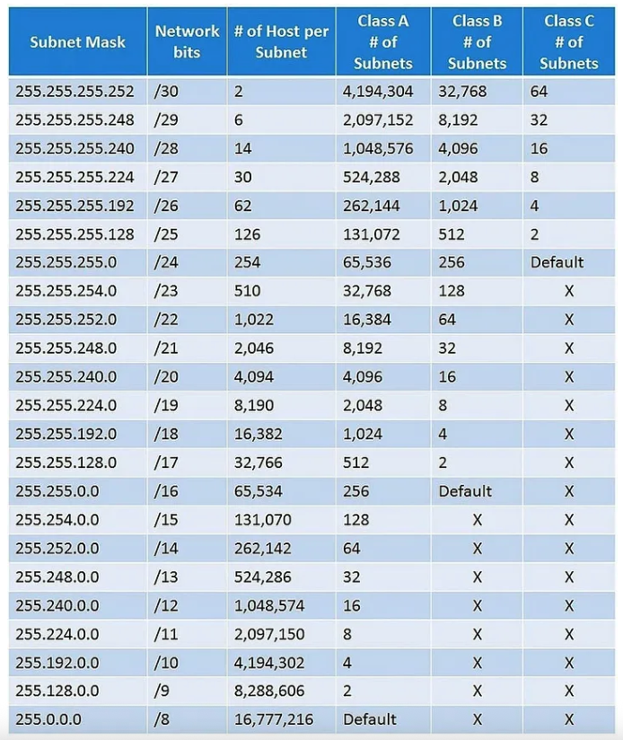

# PERTEMUAN 2 — Pengalamatan IP & Subnetting Dasar

**SI2514011 | Sub-CPMK-2 (C3) | Cisco Packet Tracer**

> Target akhir pertemuan: Anda dapat menghitung subnetting untuk kebutuhan host tertentu dan menerapkannya pada topologi dua subnet yang terhubung lewat router.

---

## Tujuan

Mahasiswa bisa menghitung subnetting sederhana dan menerapkannya untuk memisahkan dua kelompok jaringan yang terhubung lewat router.

## Materi : IP Address & Subnetting (Ringkas)

### 1. Apa itu IP Address

IP Address adalah alamat unik (32 bit, ditulis 4 angka dipisah titik) yang diberikan ke tiap perangkat di jaringan, supaya data tahu harus dikirim ke mana. Ibarat alamat rumah untuk surat.



| Jenis | Dipakai untuk |
|---|---|
| **Public** | Bisa diakses lewat internet, dipakai perangkat yang terhubung ke jaringan luar |
| **Private** | Hanya untuk jaringan lokal (LAN), tidak langsung bisa diakses dari internet |

### 2. Istilah Kunci Subnetting

| Istilah | Maksudnya |
|---|---|
| **Network address** | "Nama" jaringan itu sendiri — alamat pertama di satu blok, tidak boleh dipakai host |
| **Broadcast address** | Alamat untuk kirim data ke *semua* host dalam satu jaringan — alamat terakhir di blok, juga tidak boleh dipakai host |
| **Subnet mask** | Penentu batas mana bagian "jaringan" dan mana bagian "host" dari sebuah IP |
| **CIDR (/xx)** | Cara singkat menulis subnet mask — angka setelah `/` = jumlah bit yang dipakai untuk jaringan |

### 3. Rumus Inti (Cuma Perlu Ingat Ini)

Dari angka CIDR `/n`, hitung dulu **jumlah bit host** = `32 - n`. Setelah itu:

$$\text{Jumlah host valid} = 2^{(32-n)} - 2$$

$$\text{Blok subnet (loncatan tiap network)} = 256 - \text{oktet terakhir subnet mask yang berubah}$$

> **Kenapa dikurangi 2 di rumus host?**  
> Karena alamat pertama dipakai *network address* dan alamat terakhir dipakai *broadcast address* — keduanya tidak boleh dipasang ke perangkat.

**Tabel cepat CIDR yang paling sering dipakai** (tidak perlu hitung ulang tiap kali):

| CIDR | Subnet mask | Host valid |
|---|---|---:|
| /24 | 255.255.255.0 | 254 |
| /27 | 255.255.255.224 | 30 |
| /28 | 255.255.255.240 | 14 |
| /29 | 255.255.255.248 | 6 |
| /30 | 255.255.255.252 | 2 |

> **Kenapa tidak semua subnet diberi /24?**  
> Kalau kebutuhan host hanya 10, memberi `/24` (254 alamat) membuang 244 alamat. Memberi ukuran yang pas kebutuhan membuat alokasi alamat lebih efisien, rapi, dan mudah diaudit.

### 4. Contoh Kasus (Dipadatkan)

**a) `192.168.10.1/30`**
- Bit host = $32 - 30 = 2$ → host valid = $2^2 - 2 =$ **2**
- Blok subnet = $256 - 252 =$ **4** (jadi network berikutnya loncat 4: `.0`, `.4`, `.8`, ...)
- Untuk blok `192.168.10.0/30`: network = `.0`, host valid = `.1`–`.2`, broadcast = `.3`

**b) `172.168.10.1/16`**
- Bit host = $32 - 16 = 16$ → host valid = $2^{16} - 2 =$ **65.534**
- Satu blok besar mencakup seluruh `172.168.0.0` – `172.168.255.255`

**c) `10.168.5.1/8`**
- Bit host = $32 - 8 = 24$ → host valid = $2^{24} - 2 =$ **16.777.214**
- Satu blok raksasa mencakup seluruh `10.0.0.0` – `10.255.255.255`

> **Catatan (Classful vs Classless Addressing):**  
> Penentuan "Kelas A/B/C" di materi konvensional sebenarnya adalah sejarah lama (*classful addressing*). Dalam praktik dan standar perancangan jaringan modern saat ini, pengalamatan menggunakan sistem *classless* (CIDR) di mana alokasi cukup melihat angka CIDR-nya saja tanpa harus terpaku pada batasan kelas baku.

---

## Studi Kasus (dipakai sampai Pertemuan 5)

Kantor kecil dua divisi, dari blok `192.168.10.0/24`:

| Divisi | Kebutuhan host | Prefix | Blok | Gateway | Rentang host |
|---|---:|---|---|---|---|
| Staf | 20 | /27 | `192.168.10.0/27` | `192.168.10.1` | `.2` – `.30` |
| Tamu | 10 | /28 | `192.168.10.32/28` | `192.168.10.33` | `.34` – `.46` |

## Langkah Praktikum

1. Hitung bersama di kelas: kenapa Staf mendapat `/27` (30 host tersedia, cukup untuk 20) dan Tamu mendapat `/28` (14 host tersedia, cukup untuk 10)
2. Bangun topologi: 1 router dengan 2 interface fisik (`Gi0/0` dan `Gi0/1`), masing-masing tersambung ke satu switch, masing-masing switch punya 2 PC
3. Konfigurasi interface router:
   ```
   interface gigabitEthernet0/0
    ip address 192.168.10.1 255.255.255.224
    no shutdown
   interface gigabitEthernet0/1
    ip address 192.168.10.33 255.255.255.240
    no shutdown
   ```
4. Beri IP PC sesuai rentang host di tabel, gateway sesuai tabel (PC Staf gateway `192.168.10.1`, PC Tamu gateway `192.168.10.33`)
5. Uji `ping` dari PC Staf ke PC Tamu — harus berhasil lewat router
6. Jalankan `show ip route` di router, amati dua baris `C` (terhubung langsung)

## Tugas 2

Diberi kebutuhan host baru oleh asisten (misalnya 50 host dan 12 host) dari blok yang ditentukan:

1. Hitung sendiri subnetting yang sesuai (prefix, blok, gateway, rentang host) — tulis di tabel seperti contoh di atas
2. Terapkan di Packet Tracer: topologi 2 subnet + 1 router (seperti langkah praktikum)
3. Buktikan konektivitas antar-subnet dengan `ping`

**Format Pengumpulan Tugas:**
Mahasiswa mengumpulkan arsip file `.zip` dengan format nama `DMJK_A_P02_<NIM>_<NamaLengkap>.zip` yang berisi:
1. File simulasi `.pkt` (nama file: `DMJK_A_P02_<NIM>_<NamaLengkap>.pkt`)
2. Screenshot hasil `ping` berhasil dan output `show ip route`
3. Laporan ringkas `.pdf` (nama file: `DMJK_A_P02_<NIM>_<NamaLengkap>.pdf`) disusun mengacu pada [Template Laporan Praktikum](https://docs.google.com/document/d/1ChvPwSa-9h_i8z8RE195jK_iNLz7sTdK/edit?usp=drivesdk&ouid=101845457565241443935&rtpof=true&sd=true). Termasuk di dalamnya tabel perhitungan subnetting Anda.

---

**Pertemuan selanjutnya:** [03 — VLAN & Switching](03-pertemuan-3-vlan-switching.md)
